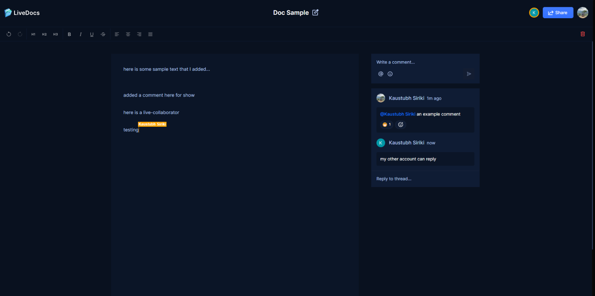

  <h1 align="center">LiveDocs - Google Docs Clone</h1>

   
  

     </img>
  

   

## Introduction

Welcome to "LiveDocs," a real-time collaborative document editing application and Google Docs clone.

## Deployment

**Warning:** It may take a few seconds to load the application.

The project is deployed on Vercel. You can view the live site here: [LiveDocs on Vercel](https://live-docs-main.vercel.app)

## Features

- **Authentication:** Secure user authentication using GitHub through NextAuth for seamless sign-in/out and session management.
- **Collaborative Text Editor:** Multiple users can edit the same document simultaneously with real-time updates.
- **Document Management:**
  - **Create Documents:** Users can create new documents, which are automatically saved and listed.
  - **Delete Documents:** Users can delete documents they own.
  - **Share Documents:** Users can share documents via email or link with view/edit permissions.
  - **List Documents:** Display all documents owned or shared with the user, with search and sorting functionalities.
- **Comments:** Add inline and general comments with threading for discussions.
- **Active Collaborators on Text Editor:** Show active collaborators with real-time presence indicators.
- **Notifications:** Notify users of document shares, new comments, and collaborator activities.
- **Responsive:** The application is fully responsive across all devices.

and many more, including code architecture and reusability.

## Technologies Used

- **Next.js:** For server-side rendering and handling the user interface.
- **TypeScript:** For type safety and an improved development experience.
- **Liveblocks:** For real-time collaborative features.
- **Lexical Editor:** For rich text editing capabilities.
- **ShadCN:** For additional UI components.
- **Tailwind CSS:** For modern and responsive styling.

## Learning Experience

This project was a fantastic learning opportunity. Following the step-by-step tutorial provided by JavaScriptMastery, I gained valuable insights into modern web development practices and real-time collaborative features. The additional features and customizations I implemented further enhanced my skills and understanding.

## Personal Touch

I aimed to go beyond the basics by incorporating unique features and interactions, making the user experience as enjoyable and intuitive as possible. This project reflects my dedication to front-end development and my attention to design details.

## Conclusion

I hope "LiveDocs" showcases my ability to build modern, responsive, and visually appealing real-time applications. Feel free to explore the project and reach out if you have any questions or feedback.

Thank you for taking the time to explore my work.

  <strong>- Kaustubh Siriki</strong>

